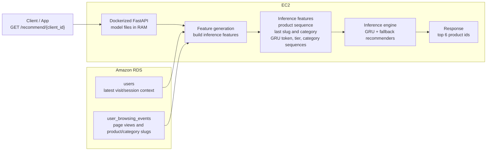
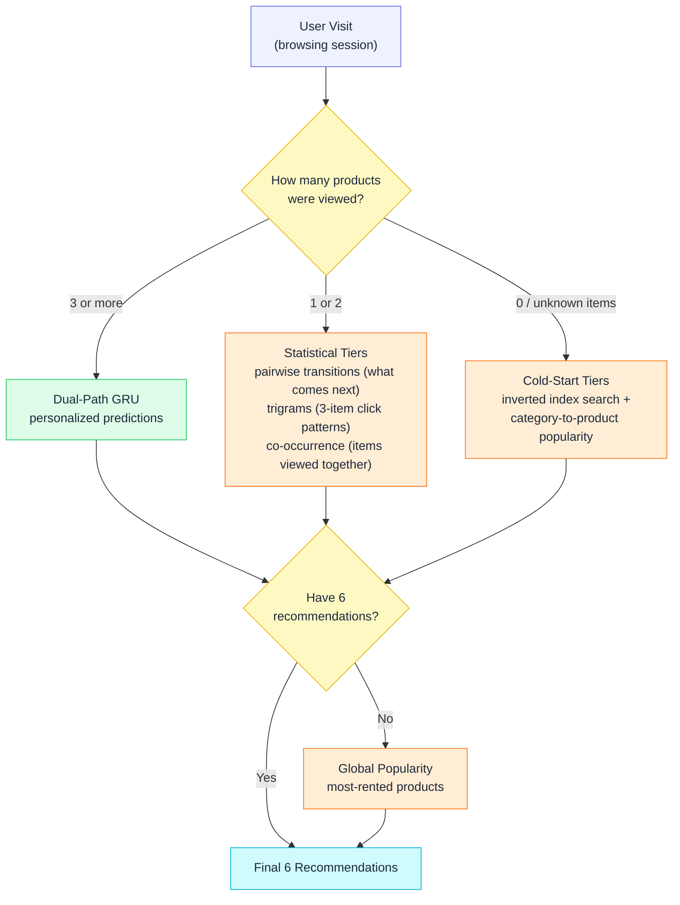
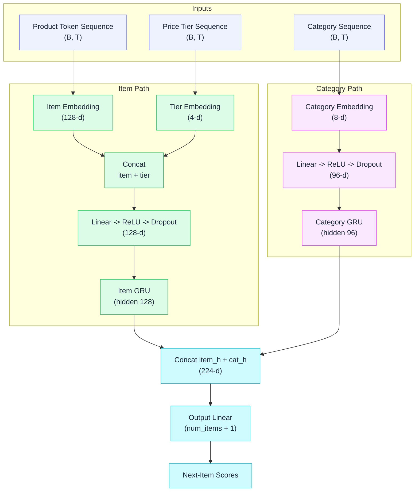

<p align="center">
  
</p>

<h1 align="center">Kaggle Rental Product Recommendation</h1>

<p align="center">
  Session-based rental product recommender using a PyTorch GRU, statistical fallback recommenders, DVC artifact versioning, and an AWS-oriented serving design.
</p>

<p align="center">
  <a href="https://www.kaggle.com/competitions/rental-product-recommendation-system">Competition</a>
  ·
  <a href="https://www.kaggle.com/code/atomstack001/rental-product-recommendation-gru">Notebook</a>
</p>

<p align="center">
  
  
  
  
  
  
  
  
</p>

## Project Highlights

🏆 **Best Kaggle score:** `Recall@6 = 0.417`

| Area | Stack | Purpose |
|---|---|---|
| Model training | PyTorch GRU, DVC, MLflow | Train the session recommender, track experiments, and reproduce pipeline runs. |
| Artifact storage | Amazon S3, DVC remote | Version intermediate and final model artifacts outside Git. |
| Model serving | FastAPI, Docker, EC2 | Serve realtime recommendations from a lightweight CPU deployment. |
| Inference data | Amazon RDS PostgreSQL | Store user/session rows and browsing events used for feature generation. |

**Recommendation logic:** GRU for richer sessions, co-occurrence/transition/trigram fallbacks for short sessions, and search/category/global popularity fallbacks for cold-start behavior.

## Reproduce The Output

This project uses [`uv`](https://docs.astral.sh/uv/) to guarantee 100% dependency reproducibility.
The training pipeline is managed with DVC so generated artifacts can be reproduced from the same code, params, and data.

```bash
git clone https://github.com/rishaviitd/kaggle.rental.product.recommendation.git
cd kaggle.rental.product.recommendation

uv sync
```

### Data Requirement

Raw competition data is not committed to this repository.
Before running the pipeline, place the required parquet files under `data/`:

```text
data/metrika_hits.parquet
data/metrika_visits.parquet
data/metrika_hits_test.parquet
data/metrika_visits_test.parquet
data/products_all.parquet
data/old_site_products.parquet
data/new_site_products.parquet
data/old_site_new_site_products.parquet
data/new_site_orders.parquet
data/old_site_orders.parquet
```

### Rebuild Artifacts Locally

Use this when you have the raw `data/` files and want to regenerate all intermediate and final artifacts.

```bash
uv run dvc repro --force
uv run inference.py
```

This creates:

```text
artifacts/intermediate/
artifacts/final/
output/predictions.csv
```

### Restore Artifacts From A DVC Remote

Use this when you have access to a DVC remote. The remote must be configured first.
It can point to S3 or to a local artifact/cache directory, depending on your setup.

Example S3 remote:

```bash
uv run dvc remote add -d artifacts-s3 s3://your-bucket/path/to/dvc-cache
```

Example local remote:

```bash
uv run dvc remote add -d artifacts-local /path/to/local/dvc-cache
```

Then restore artifacts and generate predictions:

```bash
uv run dvc pull
uv run inference.py
```

The Git repository stores code, `params.yaml`, `dvc.yaml`, and `dvc.lock`.
DVC stores generated artifacts listed as pipeline outputs.
If you want to version your own raw data with DVC, configure your own remote and run `dvc add` for the files under `data/`.

This repository contains a hybrid recommendation system built to predict the next rental product a user will interact with based on their browsing session history.

The solution heavily leverages sequence modeling alongside robust fallback strategies to handle everything from rich, long-term user histories down to complete cold-starts.

## Model Serving And Realtime Inference

The first production serving design keeps the system intentionally simple: one Dockerized FastAPI service runs on EC2, reads the minimum required inference data from RDS, downloads the final artifact bundle from S3 during deployment or service startup, and returns recommendations by `client_id`. After startup, the PyTorch model and lookup artifacts stay loaded in EC2 RAM so each request can reuse them without reading from S3 again.



### Serving Request

The client should not send model features directly. It should send only the user/session identifier:

```http
GET /recommend/{client_id}
```

Example response:

```json
{
  "client_id": "0911978007540833652",
  "recommendations": ["123", "456", "789", "222", "333", "444"]
}
```

### RDS Tables

The RDS schema should store only the fields needed during inference, not the full training parquet schema. For serving, the two test parquet datasets map to two lean RDS tables.

`metrika_visits_test.parquet` becomes the `users` table:

```text
client_id
visit_id
date_time
```

`metrika_hits_test.parquet` becomes the `user_browsing_events` table:

```text
watch_id/event_id
client_id
date_time
page_type
slug
```

These two tables are enough to build all per-request inference features:

```text
product_sequence
last_slug
last_category_slug
GRU token sequence
price tier sequence
category index sequence
```

### Connect To Private RDS From A Laptop

The RDS instance is private, so local development connects through the EC2 instance:

```text
Laptop -> SSH tunnel -> EC2 -> RDS PostgreSQL
```

First, allow the EC2 security group to access the RDS security group on PostgreSQL port `5432`. In the AWS RDS console, this can be configured with **Set up EC2 connection**.

Verify the connection from EC2:

```bash
ssh -i ~/Downloads/my-first-ec2.pem ec2-user@ec2-54-237-239-176.compute-1.amazonaws.com
sudo dnf install -y nmap-ncat
nc -zv database-1.catyw6k6aqj6.us-east-1.rds.amazonaws.com 5432
```

The connectivity check should report that it connected to port `5432`. Exit the EC2 shell, then open the SSH tunnel from the laptop:

```bash
ssh -i ~/Downloads/my-first-ec2.pem \
  -N \
  -L 5433:database-1.catyw6k6aqj6.us-east-1.rds.amazonaws.com:5432 \
  ec2-user@ec2-54-237-239-176.compute-1.amazonaws.com
```

Keep that terminal open. In a second terminal, install the asynchronous PostgreSQL driver:

```bash
uv add asyncpg
```

Set the local connection variables. Never commit the database password:

```bash
export DB_HOST=localhost
export DB_PORT=5433
export DB_NAME=postgres
export DB_USER=recommenderdb
export DB_PASSWORD='YOUR_RDS_PASSWORD'
```

Test the connection through the tunnel:

```bash
uv run python -c 'import asyncio, asyncpg, os; exec("async def main():\n    conn = await asyncpg.connect(host=os.environ[\"DB_HOST\"], port=int(os.environ[\"DB_PORT\"]), database=os.environ[\"DB_NAME\"], user=os.environ[\"DB_USER\"], password=os.environ[\"DB_PASSWORD\"], ssl=\"require\")\n    print(await conn.fetchval(\"SELECT version()\"))\n    await conn.close()\nasyncio.run(main())")'
```

For local tools and scripts, RDS is now available through:

```text
host: localhost
port: 5433
database: postgres
```

### Database Migrations

The PostgreSQL schema is defined with SQLAlchemy models in `server/models.py` and versioned with Alembic migrations under `migrations/versions/`.

Install and initialize the migration tooling:

```bash
uv add sqlalchemy alembic greenlet
uv run alembic init migrations
```

Generate a migration after changing the SQLAlchemy models:

```bash
uv run alembic revision --autogenerate -m "create inference tables"
```

Review the generated file under `migrations/versions/`, then apply it to RDS:

```bash
uv run alembic upgrade head
```

Useful migration commands:

```bash
uv run alembic current
uv run alembic history
uv run alembic downgrade -1
```

Alembic versions the database schema only. RDS rows are handled separately through data-loading scripts and RDS backups.

### Runtime Flow

On service startup:

```text
1. Ensure artifacts/final exists on EC2.
2. If needed, download final artifacts from S3.
3. Load pickle/json artifacts.
4. Load model.pt into CPU memory.
5. Start FastAPI.
```

Per request:

```text
1. Receive client_id.
2. Query users for the latest visit/session context.
3. Query user_browsing_events for that client/session window.
4. Build inference features:
   product_sequence
   last_slug
   last_category_slug
   GRU token sequence
   price tier sequence
   category index sequence
5. Run GRU/fallback inference.
6. Return top 6 product ids.
```

The final artifact bundle is small, around 2.6 MB, so the model and lookup artifacts should stay loaded in memory on EC2. Each request should only query RDS and run feature generation/inference; it should not reload the model.

## Overall Architecture

The system operates as a **Multi-Tiered Recommender**. The core of the system is a Dual-Path GRU (Gated Recurrent Unit) neural network that predicts the next item in a sequence based on recent product clicks, price tier, and category context.

Because neural networks struggle with very short sessions (e.g., 1 or 2 clicks), the system falls back to simpler statistical strategies based on how many products the user actually viewed. This routing guarantees 6 high-quality recommendations for every single visit, even for brand-new products with no history.



The session length decides which tier handles the visit, and unfilled slots always cascade down to global popularity:

* **Tier 1: GRU Predictions (Rich Sessions)**
  * Used for sessions with 3 or more product interactions, leveraging the trained neural network for highly contextual, personalized recommendations.

* **Tier 2: Co-occurrence & Transitions (Short Sessions)**
  * Used for 1–2 interaction sessions, relying on pairwise transition tables (what product usually comes next), trigrams (common 3-item click patterns), and co-occurrence (items often viewed together).

* **Tier 3: Search & Behavioral Fallback (Cold Start)**
  * Queries an inverted index over product-URL keywords to match cold-start items, then falls back to category-to-product popularity from the last viewed category.

* **Tier 4: Global Popularity (Absolute Fallback)**
  * Fills any remaining slots with the most-rented products overall, guaranteeing exactly 6 valid predictions for every visit.

---

## Dual Path GRU Architecture

The primary prediction engine is a custom PyTorch sequence model built from compact inputs that proved most useful in ablations.

* **GRU Inputs**
  * Product token sequence from merged browsing sessions.
  * Price tier embedding for each clicked product.
  * Category sequence for the parallel category GRU path.

* **Training-Time Recency Weighting**
  * Applies exponential sample weighting on session age so more recent browsing sessions contribute more to the training loss.



* **Item Path**
  * Feeds the sequence of clicked product IDs and price tier embeddings into a dedicated GRU layer.
  * Learns relationships between specific items based on chronological user journeys.

* **Category Path**
  * Simultaneously feeds the sequence of product categories into a parallel, secondary GRU layer.
  * Allows the model to recognize high-level intent (e.g., "this user is looking at strollers") even if it hasn't seen the specific item IDs before.
