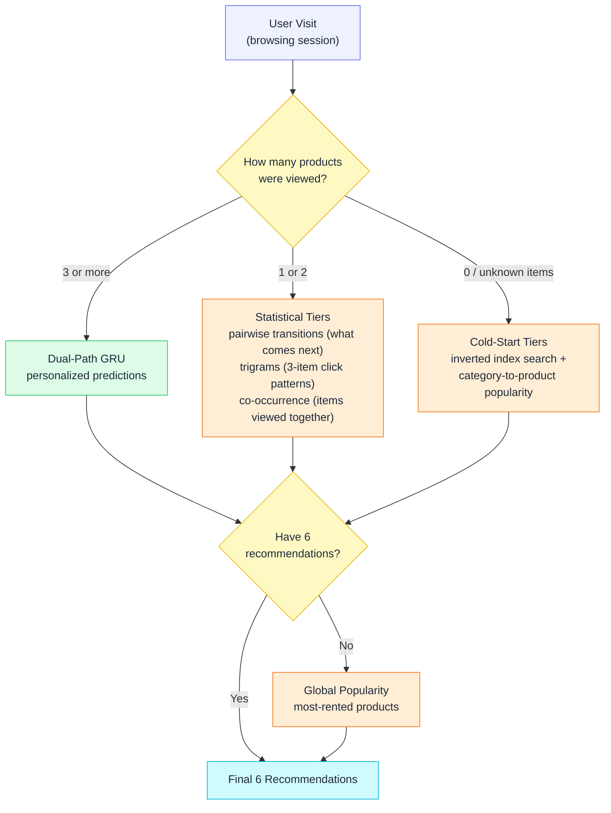
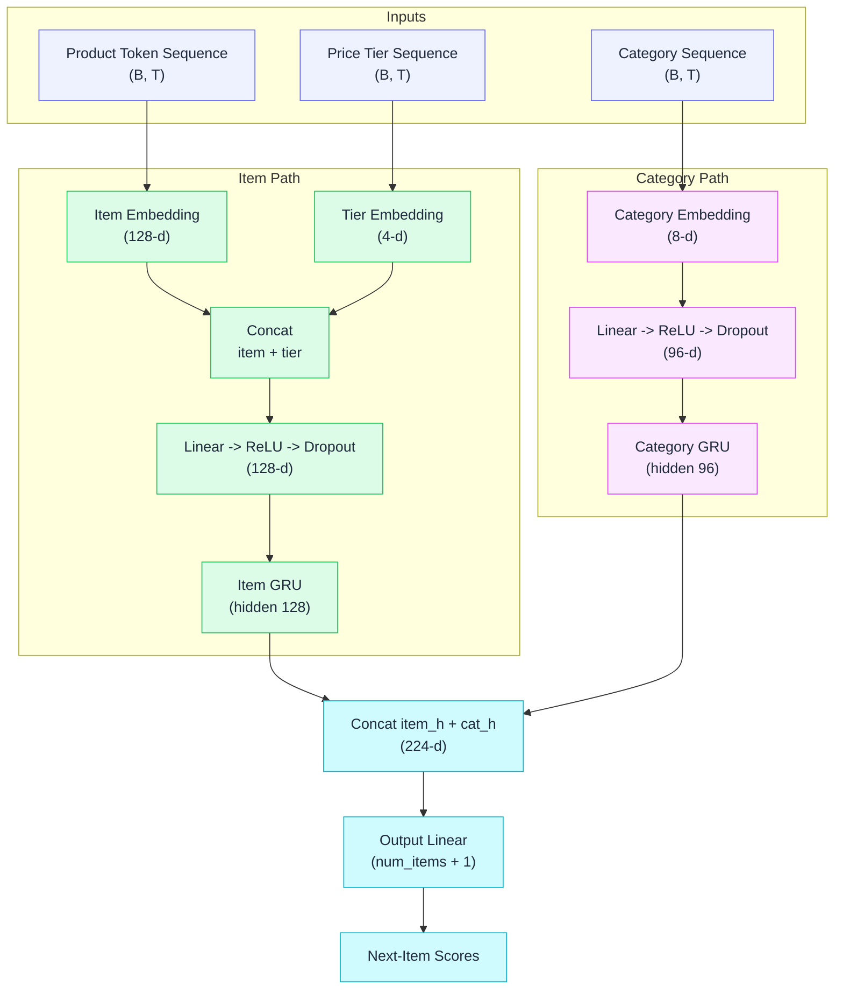

# Kaggle Rental Product Recommendation

🏆 **Best Score on Kaggle (Recall@6: 0.417)**
* **Notebook:** [Rental Product Recommendation GRU](https://www.kaggle.com/code/atomstack001/rental-product-recommendation-gru)
* **Competition:** [Rental Product Recommendation System](https://www.kaggle.com/competitions/rental-product-recommendation-system)

## 🚀 Quick Start (Reproduce in 3 Steps)

This project uses [`uv`](https://docs.astral.sh/uv/) to guarantee 100% dependency reproducibility.

```bash
# 1. Clone the repository
git clone https://github.com/rishaviitd/kaggle.rental.product.recommendation.git
cd kaggle.rental.product.recommendation

# 2. Instantly recreate the exact locked environment
uv sync

# 3. Train model and save inference artifacts
uv run train.py

# 4. Generate output/predictions.csv from saved artifacts
uv run inference.py
```

This repository contains a hybrid recommendation system built to predict the next rental product a user will interact with based on their browsing session history.

The solution heavily leverages sequence modeling alongside robust fallback strategies to handle everything from rich, long-term user histories down to complete cold-starts.

## Overall Architecture

The system operates as a **Multi-Tiered Recommender**. The core of the system is a Dual-Path GRU (Gated Recurrent Unit) neural network that predicts the next item in a sequence based on recent product clicks, price tier, and category context.

Because neural networks struggle with very short sessions (e.g., 1 or 2 clicks), the system falls back to simpler statistical strategies based on how many products the user actually viewed. This routing guarantees 6 high-quality recommendations for every single visit, even for brand-new products with no history.



The session length decides which tier handles the visit, and unfilled slots always cascade down to global popularity:

* **Tier 1: GRU Predictions (Rich Sessions)**
  * Used for sessions with 3 or more product interactions, leveraging the trained neural network for highly contextual, personalized recommendations.

* **Tier 2: Co-occurrence & Transitions (Short Sessions)**
  * Used for 1–2 interaction sessions, relying on pairwise transition tables (what product usually comes next), trigrams (common 3-item click patterns), and co-occurrence (items often viewed together).

* **Tier 3: Search & Behavioral Fallback (Cold Start)**
  * Queries an inverted index over product-URL keywords to match cold-start items, then falls back to category-to-product popularity from the last viewed category.

* **Tier 4: Global Popularity (Absolute Fallback)**
  * Fills any remaining slots with the most-rented products overall, guaranteeing exactly 6 valid predictions for every visit.

---

## Dual Path GRU Architecture

The primary prediction engine is a custom PyTorch sequence model built from compact inputs that proved most useful in ablations.

* **GRU Inputs**
  * Product token sequence from merged browsing sessions.
  * Price tier embedding for each clicked product.
  * Category sequence for the parallel category GRU path.

* **Training-Time Recency Weighting**
  * Applies exponential sample weighting on session age so more recent browsing sessions contribute more to the training loss.



* **Item Path**
  * Feeds the sequence of clicked product IDs and price tier embeddings into a dedicated GRU layer.
  * Learns relationships between specific items based on chronological user journeys.

* **Category Path**
  * Simultaneously feeds the sequence of product categories into a parallel, secondary GRU layer.
  * Allows the model to recognize high-level intent (e.g., "this user is looking at strollers") even if it hasn't seen the specific item IDs before.
